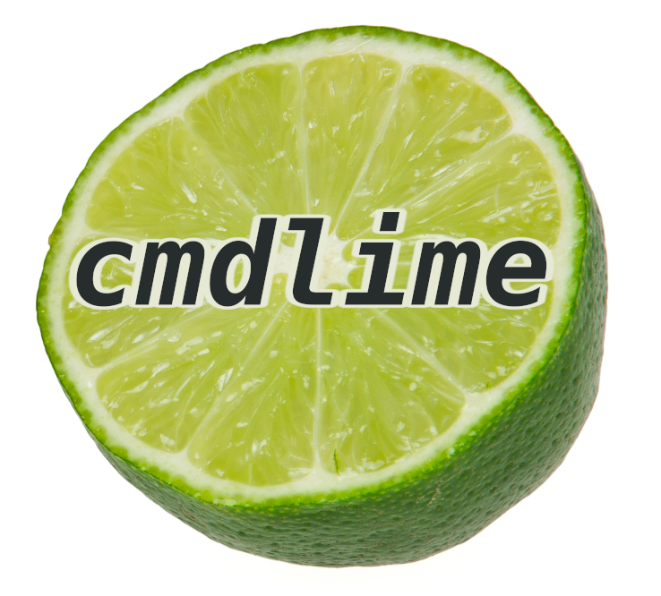

<p align="center">
    
</p>

**cmdlime** - is a C++17 header-only library for command line parsing with minimum of code and ~~pain~~ things to remember. See for yourself:

```C++
///examples/ex01.cpp
///
#include <cmdlime/config.h>
#include <iostream>

int main(int argc, char** argv)
{
    struct Cfg : public cmdlime::Config{
        CMDLIME_ARG(zipCode, int);
        CMDLIME_PARAM(name, std::string);
        CMDLIME_FLAG(verbose);
    } cfg;

    auto reader = cmdlime::ConfigReader{cfg, "person-finder"};
    if (!reader.readCommandLine(argc, argv))
        return reader.exitCode();

    //At this point your config is ready to use
    std::cout << "Looking for person " << cfg.name << " in the region with zip code: " << cfg.zipCode;
    return 0;
}
```

The default configuration conforms to the GNU command line options convention, so this program can be launched like this:
```console
kamchatka-volcano@home:~$ ./person-finder 684007 --name John --verbose
Looking for person John in the region with zip code: 684007
```

Please note, that in this example, `--name` is a parameter, `--verbose` is a flag, and `684007` is an argument, this naming is used in this document and within the **cmdlime** interface.


## Table of Contents
*    [Usage](#usage)
     *    [Declaring the config structure](#declaring-the-config-structure)
     *    [Using ConfigReader](#using-configreader) 
     *    [Custom names](#custom-names)
     *    [Auto-generated usage info](#auto-generated-usage-info)
     *    [Supported formats](#supported-formats)
          *    [GNU](#gnu)
          *    [POSIX](#posix)
          *    [X11](#x11)
          *    [Simple format](#simple-format)
     *    [Using custom types](#using-custom-types)
     *    [Using subcommands](#using-subcommands)
*    [Installation](#installation)
*    [Running tests](#running-tests)
*    [License](#license)

## Usage


### Declaring the config structure

To use **cmdlime** you need to create a structure with fields corresponding to parameters, flags and arguments readed from the command line.  
To do this subclass `cmdlime::Config` and declare fields with the following macros:
- **CMDLIME_ARG(`name`, `type`)** - creates `type name;` config field and registers it in the parser.  
Arguments are mapped to the config fields in the order of declaration. Arguments can't have default values and are always required to be specified in the command line.
- **CMDLIME_ARGLIST(`name`, `type`)** - creates `std::vector<type> name;` config field and registers it in the parser.  
 Config can have only one arguments list and elements are placed into it after all other config arguments are set, regardless of the order of declaration. The declaration form **CMDLIME_ARGLIST(`name`, `type`)(`list-initialization`)** sets the default value of an argument list, which makes it optional, so it can be omitted from the command line without raising an error.
- **CMDLIME_PARAM(`name`, `type`)** - creates `type name;` config field and registers it in the parser.  
The declaration form **CMDLIME_PARAM(`name`, `type`)(`default value`)** sets the default value of a parameter, which makes it optional, so it can be omitted from the command line without raising an error.
- **CMDLIME_PARAMLIST(`name`, `type`)** - creates `std::vector<type> name;` config field and registers it in the parser.   
Parameter list can be filled by specifying it in the command line multiple times (`--param-list val1 --param-list val2`) or passing a comma separated value (`--param-list val1,val2`).  
The declaration form **CMDLIME_PARAMLIST(`name`, `type`)(`list-initialization`)** sets the default value of a parameter list, which makes it optional, so it can be omitted from the command line without raising an error.
- **CMDLIME_FLAG(`name`)** - creates `bool name;` config field and registers it in the parser.  
Flags are always optional and have default value `false`  
- **CMDLIME_EXITFLAG(`name`)** - creates `bool name;` config field and registers it in the parser. 
If at least one exit flag is set,  no parsing errors are raised regardless of the command line's content and config fields other than exit flags are left in an unspecified state. It's usefull for flags like `--help` or `--version` when you're supposed to print some message and exit the program without checking the other fields.
- **CMDLIME_SUBCOMMAND(`name`, `type`)** - creates `std::optional<type> name;` config field for nested configuration structure and registers it in the parser. Type must be a subclass of cmdlime::Config. Subcommands are always optional and have default value `std::optional<type>{}`.
- **CMDLIME_COMMAND(`name`, `type`)** - creates `std::optional<type> name;` config field for nested configuration structure and registers it in the parser. Type must be a subclass of cmdlime::Config. Commands are always optional and have default value `std::optional<type>{}`. If command is encountered, no parsing errors for other config fields are raised and they are left in an unspecified state.

*Note: Types used for config fields must be default constructible and copyable.*  

*Another note: You don't need to change your code style when declaring config fields - `camelCase`, `snake_case` and `PascalCase` names are supported and readed from the `kebab-case` named parameters in the command line.*  

Let's alter the config for the `person-finder` program by adding a required parameter `surname` and making the `name` parameter optional:
```C++
///examples/ex02.cpp
///
struct Cfg : public cmdlime::Config{
	CMDLIME_ARG(zipCode, int);
    CMDLIME_PARAM(surname, std::string);
    CMDLIME_PARAM(name, std::string)();
    CMDLIME_FLAG(verbose);
} cfg;
```
Now parameter `--name` can be skipped without raising an error:
```console
kamchatka-volcano@home:~$ ./person-finder 684007 --surname Deer
Looking for person Deer in region with zip code: 684007
```

### Using ConfigReader

`ConfigReader` - is a helper class hiding the error handling boilerplate and adding`--help` and `--version` flags processing to your config.  
`--help` flag shows a detailed help message, that otherwise can be accessed through the `Config::usageInfoDetailed()` method.  
`--version` flag is enabled only if version info is set in the config with the `Config::setVersionInfo` method.  
Let's modify `person-finder` and see how it works.

```C++
///examples/ex03.cpp
///
...
    cfg.setVersionInfo("person-finder 1.0");
    auto reader = cmdlime::ConfigReader{cfg, "person-finder"};
    if (!reader.readCommandLine(argc, argv))
        return reader.exitCode();
...
```
```console
kamchatka-volcano@home:~$ ./person-finder --version
person-finder 1.0
kamchatka-volcano@home:~$ ./person-finder --help
Usage: person-finder <zip-code> --surname <string> [params] [flags] 
Arguments:
    <zip-code> (int)          
Parameters:
   -s, --surname <string>     
   -n, --name <string>        optional
Flags:
   -v, --verbose              
       --help                 show usage info and exit
       --version              show version info and exit
```

As mentioned before, `ConfigReader` is just a helper class, so if you like typing a lot, it's possible to implement the same program without using it:
```C++
///examples/ex04.cpp
///
#include <cmdlime/config.h>
#include <iostream>

int main(int argc, char** argv)
{
    struct Cfg : public cmdlime::Config{
        CMDLIME_ARG(zipCode, int);
        CMDLIME_PARAM(name, std::string);
        CMDLIME_FLAG(verbose);
        CMDLIME_EXITFLAG(help);
        CMDLIME_EXITFLAG(version);        
    } cfg;
	
    try{
    	cfg.readCommandLine(argc, argv);
    }
    catch(const cmdlime::Error& e){
    	std::cerr << e.what();
        std::cout << cfg.usageInfo();
        return -1;
    }
    if (cfg.help){
    	std::cout << cfg.usageInfoDetailed();
        return 0;
    }
    if (cfg.version){
    	std::cout << "person-finder 1.0";
        return 0;
    }
    //At this point your config is ready to use
    std::cout << "Looking for person " << cfg.name << " in the region with zip code: " << cfg.zipCode;
    return 0;
}
```

Try to run it and...
```console
Usage: person-finder <zip-code> --name <string> [--verbose] [--help] [--version]
Flag's short name 'v' is already used.
```
you'll get this error. The thing is, the default command line format supports short names and our flags `--verbose` and `--version` ended up having the same short name `-v`. Read the next section to learn how to fix it.


### Custom names

```C++
///examples/ex05.cpp
///
struct Cfg : public cmdlime::Config{
    CMDLIME_ARG(zipCode, int);
    CMDLIME_PARAM(name, std::string);
    CMDLIME_FLAG(verbose);
    CMDLIME_EXITFLAG(help)    << cmdlime::WithoutShortName{};
    CMDLIME_EXITFLAG(version) << cmdlime::WithoutShortName{};
} cfg;

```
Here's the fixed config. Turning off the short name generation for flag `--version` resolves the name conflict. When you rely on `ConfigReader` for handling of `--help` and `--version` flags, it creates them without short names. At this point, we should do this as well, and all following examples will be based on our original version of `person-finder` program that uses `ConfigReader`.


You can use the following objects to customize names generation:  
`cmdlime::Name{"customName"}` - overrides command line option's name.  
`cmdlime::ShortName{"customShortName"}` - overrides command line option's short name.  
`cmdlime::WithoutShortName{}` - removes command line option's short name.  
`cmdlime::ValueName{}` - overrides parameter's value name in the usage info. 

And it's time for another `person-finder`'s rewrite:
```C++
///examples/ex06.cpp
///
struct Cfg : public cmdlime::Config{
    CMDLIME_ARG(zipCode, int);
    CMDLIME_PARAM(surname, std::string)  << cmdlime::ValueName{"A-Z..."};
    CMDLIME_PARAM(name, std::string)()   << cmdlime::Name{"first-name"};
    CMDLIME_FLAG(verbose);
} cfg;
```
```console
kamchatka-volcano@home:~$ ./person-finder --help
Usage: person-finder <zip-code> --surname <A-Z...> [params] [flags] 
Arguments:
    <zip-code> (int)             
Parameters:
   -s, --surname <A-Z...>     
   -n, --first-name <string>     optional
Flags:
   -v, --verbose                 
       --help                    show usage info and exit
       --version                 show version info and exit

```
### Auto-generated usage info

**cmdlime** can generate help messages accessible with `Config::usageInfo()` and `Config::usageInfoDetailed()` methods. The former is the compact version that is supposed to be shown alongside error messages, the latter is the detailed version that is printed out when `--help` flag is set.

We can add more information to the detailed usage info by setting the parameters` descriptions:
```C++
///examples/ex07.cpp
///
struct Cfg : public cmdlime::Config{
    CMDLIME_ARG(zipCode, int)              << "zip code of the searched region";
    CMDLIME_PARAM(surname, std::string)    << "surname of the person to find"       << cmdlime::ValueName{"A-Z..."};
    CMDLIME_PARAM(name, std::string)()     << "name of the person to find"          << cmdlime::Name{"first-name"};
    CMDLIME_FLAG(verbose)                  << "adds more information to the output";
} cfg;

```
```console
kamchatka-volcano@home:~$ ./person-finder --help
Usage: person-finder <zip-code> --surname <A-Z...> [params] [flags] 
Arguments:
    <zip-code> (int)             zip code of the searched region
Parameters:
   -s, --surname <A-Z...>     surname of the person to find
   -n, --first-name <string>     name of the person to find
                                   (optional)
Flags:
   -v, --verbose                 adds more information to the output
       --help                    show usage info and exit
       --version                 show version info and exit
```

If you don't like auto-generated usage info message you can set your own with `Config::setUsageInfo()` and `Config::setUsageInfoDetailed()`

### Supported formats

**cmdlime** supports several command line naming conventions and unlike many other parsers it strictly enforces them, so you can't mix usage of different formats together.

All formats support argument delimiter `--`,  after encountering it, all command line options are treated as arguments, even if they start with hyphens.

#### GNU

All names are in `kebab-case`.  
Parameters and flags prefix: `--`  
Short names are supported.  Short names prefix: `-`  
Parameters usage: `--parameter value`, `--parameter=value`, `-p value` or `-pvalue`  
Flags usage: `--flag`, `-f`  
Flags in short form can be "glued" together: `-abc` or with one parameter: `-fp value`

This is the default command line format used by **cmdlime**. Subclass your config structure from `cmdlime::Config` or `cmdlime::GNUConfig` to use it.

```C++
///examples/ex08.cpp
///
#include <cmdlime/config.h>
struct Cfg : public cmdlime::Config{
    CMDLIME_ARG(zipCode, int)              << "zip code of the searched region";
    CMDLIME_PARAM(surname, std::string)    << "surname of the person to find";
    CMDLIME_PARAM(name, std::string)()     << "name of the person to find";
    CMDLIME_FLAG(verbose)                  << "adds more information to the output";
} cfg;
```

```console
kamchatka-volcano@home:~$ ./person-finder --help
Usage: person-finder <zip-code> --surname <string> [params] [flags] 
Arguments:
    <zip-code> (int)          zip code of the searched region
Parameters:
   -s, --surname <string>     surname of the person to find
   -n, --name <string>        name of the person to find
                                (optional)
Flags:
   -v, --verbose              adds more information to the output
       --help                 show usage info and exit
       --version              show version info and exit
```

#### POSIX

All names consist of single alphanumeric character.  
Parameters and flags prefix: `-`  
Short names aren't supported (the default names are already short enough).  
Parameters usage: `-p value` or `-pvalue`  
Flags usage: `-f`  
Flags in short form can be "glued" together: `-abc` or with one parameter: `-fp value`

Parameters and flags must precede the arguments, besides that, this format is a subset of GNU format.

Subclass your config structure from `cmdlime::POSIXConfig` to use it.
```C++
///examples/ex09.cpp
///
#include <cmdlime/posixconfig.h>
struct Cfg : public cmdlime::POSIXConfig{
    CMDLIME_ARG(zipCode, int)              << "zip code of the searched region";
    CMDLIME_PARAM(surname, std::string)    << "surname of the person to find";
    CMDLIME_PARAM(name, std::string)()     << "name of the person to find";
    CMDLIME_FLAG(verbose)                  << "adds more information to the output" << cmdlime::Name{"V"};
} cfg;

```
*Note: here's the clashing names error again, so we have to rename `verbose` config field flag from `-v` to `-V`*

```console
kamchatka-volcano@home:~$ ./person-finder -h
Usage: person-finder <zip-code> -s <string> [params] [flags] 
Arguments:
    <zip-code> (int)     zip code of the searched region
Parameters:
   -s <string>           surname of the person to find
   -n <string>           name of the person to find
                           (optional)
Flags:
   -V                    adds more information to the output
   -h                    show usage info and exit
   -v                    show version info and exit
```

#### X11
All names are in `lowercase`.  
Parameters and flags prefix: `-`  
Short names aren't supported.  
Parameters usage: `-parameter value`  
Flags usage: `-flag`

Subclass your config structure from `cmdlime::X11Config` to use it.
```C++
///examples/ex10.cpp
///
#include <cmdlime/x11config.h>
struct Cfg : public cmdlime::X11Config{
    CMDLIME_ARG(zipCode, int)              << "zip code of the searched region";
    CMDLIME_PARAM(surname, std::string)    << "surname of the person to find";
    CMDLIME_PARAM(name, std::string)()     << "name of the person to find";
    CMDLIME_FLAG(verbose)                  << "adds more information to the output";
} cfg;
```
```console
kamchatka-volcano@home:~$ ./person-finder -help
Usage: person-finder <zipcode> -surname <string> [params] [flags] 
Arguments:
    <zipcode> (int)      zip code of the searched region
Parameters:
   -surname <string>     surname of the person to find
   -name <string>        name of the person to find
                           (optional)
Flags:
   -verbose              adds more information to the output
   -help                 show usage info and exit
   -version              show version info and exit
```

#### Simple format
This format is created for development purposes of **cmdlime** as it's the easiest one to parse, so **cmdlime** unit tests are probably the only software that use it.

All names are in `camelCase`.  
Parameters prefix: `-`  
Flags prefix: `--`  
Short names aren't supported.  
Parameters usage: `-parameter=value`   
Flags usage: `--flag`

Subclass your config structure from `cmdlime::SimpleConfig` to use it.
```C++
///examples/ex11.cpp
///
#include <cmdlime/simpleconfig.h>
struct Cfg : public cmdlime::SimpleConfig{
    CMDLIME_ARG(zipCode, int)              << "zip code of the searched region";
    CMDLIME_PARAM(surname, std::string)    << "surname of the person to find";
    CMDLIME_PARAM(name, std::string)()     << "name of the person to find";
    CMDLIME_FLAG(verbose)                  << "adds more information to the output";
} cfg;
```
```console
kamchatka-volcano@home:~$ ./person-finder --help
Usage: person-finder <zipCode> -surname=<string> [params] [flags] 
Arguments:
    <zipCode> (int)      zip code of the searched region
Parameters:
   -surname=<string>     surname of the person to find
   -name=<string>        name of the person to find
                           (optional)
Flags:
  --verbose              adds more information to the output
  --help                 show usage info and exit
  --version              show version info and exit
```

### Using custom types
To use custom types in the config, it's necessary to overload `std::stringstream` `operator<<` and `operator>>`.  
Let's add a coordinate parameter `--coord` to the `person-finder` program.

```C++
///examples/ex12.cpp
///
#include <cmdlime/config.h>
#include <iostream>
#include <sstream>

struct Coord{
    double lat;
    double lon;
};
std::stringstream& operator<<(std::stringstream& stream, const Coord& coord)
{
    stream << coord.lat << "-" << coord.lon;
    return stream;
}
std::stringstream& operator>>(std::stringstream& stream, Coord& coord)
{
    auto coordStr = std::string{};
    stream >> coordStr;
    auto delimPos = coordStr.find('-');
    if (delimPos == std::string::npos)
        throw cmdlime::Error{"Wrong coord format"};
    coord.lat = std::stod(coordStr.substr(0, delimPos));
    coord.lon = std::stod(coordStr.substr(delimPos + 1, coordStr.size() - delimPos - 1));
    return stream;
}


int main(int argc, char** argv)
{
    struct Cfg : public cmdlime::Config{
        CMDLIME_ARG(zipCode, int)              << "zip code of the searched region";
        CMDLIME_PARAM(surname, std::string)    << "surname of the person to find";
        CMDLIME_PARAM(name, std::string)()     << "name of the person to find";
        CMDLIME_PARAM(coord, Coord)            << "possible location";
        CMDLIME_FLAG(verbose)                  << "adds more information to the output";
    } cfg;


    cfg.setVersionInfo("person-finder 1.0");
    auto reader = cmdlime::ConfigReader{cfg, "person-finder"};
    if (!reader.readCommandLine(argc, argv))
        return reader.exitCode();

    //At this point your config is ready to use
    std::cout << "Looking for person " << cfg.name << " " << cfg.surname << " in the region with zip code: " << cfg.zipCode << std::endl;
    std::cout << "Possible location:" << cfg.coord.lat << " " << cfg.coord.lon;
    return 0;
}

```
```console
kamchatka-volcano@home:~$ ./person-finder 684007 --surname Deer --coord 53.0-157.25
Looking for person  Deer in the region with zip code: 684007
Possible location:53 157.25
```

### Using subcommands

With **cmdlime** it's possible to place a config structure inside other config's field by creating a subcommand. Subcommands are specified in command line by their full name and all following parameters are used to fill a subcommand's structure instead of the main one.  
Let's enhance `person-finder` programm by adding a result recording mode.
```C++
///examples/ex13.cpp
///
#include <cmdlime/config.h>

int main(int argc, char** argv)
{
    struct RecordCfg: public cmdlime::Config{
        CMDLIME_PARAM(file, std::string)() << "save result to file";
        CMDLIME_PARAM(db, std::string)()   << "save result to database";
        CMDLIME_FLAG(detailed)             << "adds more information to the result" << cmdlime::WithoutShortName{};
    };
    
    struct Cfg : public cmdlime::Config{
        CMDLIME_ARG(zipCode, int)               << "zip code of the searched region";
        CMDLIME_PARAM(surname, std::string)     << "surname of the person to find";
        CMDLIME_PARAM(name, std::string)()      << "name of the person to find";
        CMDLIME_FLAG(verbose)                   << "adds more information to the output";
        CMDLIME_SUBCOMMAND(record, RecordCfg)   << "record search result";
    } cfg;

    auto reader = cmdlime::ConfigReader{cfg, "person-finder"};
    if (!reader.readCommandLine(argc, argv))
        return reader.exitCode();
    std::cout << "Looking for person " << cfg.name << " " << cfg.surname << " in the region with zip code: " << cfg.zipCode << std::endl;
    if (cfg.record.has_value())
        std::cout << "Record settings: " << "file:" << cfg.record->file << " db:" << cfg.record->db << " detailed:" << cfg.record->detailed << std::endl;
    return 0;
}
```
Now, `person-finder` can be launched like this:

```console
kamchatka-volcano@home:~$ ./person-finder 684007 --surname Deer record --file res.txt --detailed
Looking for person  Deer in the region with zip code: 684007
Record settings: file:res.txt db: detailed:1
```

Note that all required config fields like `zipCode` positional argument and `surname` parameter must still be specified. Some subcommands don't need that, imagine that `person-finder` has a search history mode that doesn't require those parameters, and needs to be launched like this: `./person-finder history` without raising a parsing error.   
It can be easily achieved by registering `history` as a command instead of the subcommand. The main difference is that while command is also stored in the main config's field, logically it's an alternative configuration, not a part of the original one. When command is present in the command line, other config fields aren't read at all and left in an unspecified state.


Let's see how it works:

```C++
///examples/ex14.cpp
///
#include <cmdlime/config.h>

int main(int argc, char** argv)
{
    struct RecordCfg: public cmdlime::Config{
        CMDLIME_PARAM(file, std::string)() << "save result to file";
        CMDLIME_PARAM(db, std::string)()   << "save result to database";
        CMDLIME_FLAG(detailed)             << "hide search results" << cmdlime::WithoutShortName{};
    };

    struct HistoryCfg: public cmdlime::Config{
        CMDLIME_PARAM(surname, std::string)() << "filter search queries by surname";
        CMDLIME_FLAG(noResults)               << "hide search results";
    };

    struct Cfg : public cmdlime::Config{
        CMDLIME_ARG(zipCode, int)             << "zip code of the searched region";
        CMDLIME_PARAM(surname, std::string)   << "surname of the person to find";
        CMDLIME_PARAM(name, std::string)()    << "name of the person to find";
        CMDLIME_FLAG(verbose)                 << "adds more information to the output";
        CMDLIME_SUBCOMMAND(record, RecordCfg) << "record search result";
        CMDLIME_COMMAND(history, HistoryCfg)  << "show search history";
    } cfg;

    auto reader = cmdlime::ConfigReader{cfg, "person-finder"};
    if (!reader.readCommandLine(argc, argv))
        return reader.exitCode();

    if (cfg.history.has_value()){
        std::cout << "Preparing search history with surname filter:" << cfg.history->surname << std::endl;
        return 0;
    }

    std::cout << "Looking for person " << cfg.name << " " << cfg.surname << " in the region with zip code: " << cfg.zipCode << std::endl;
    if (cfg.record.has_value())
        std::cout << "Record settings: " << "file:" << cfg.record->file << " db:" << cfg.record->db << " detailed:" << cfg.record->detailed << std::endl;

    return 0;
}
```

```console
kamchatka-volcano@home:~$ ./person-finder history --surname Doe
Preparing search history with surname filter:Doe
```

As you can see a config structure can have multiple commands, but only one can be specified for each config.


## Installation
Download and link the library from your project's CMakeLists.txt:
```
cmake_minimum_required(VERSION 3.14)

include(FetchContent)

FetchContent_Declare(cmdlime
    GIT_REPOSITORY "https://github.com/kamchatka-volcano/cmdlime.git"
    GIT_TAG "origin/master"
)
FetchContent_MakeAvailable(cmdlime)

add_executable(my_app)
target_link_libraries(myapp PRIVATE cmdlime)
```

For the system-wide installation use these commands:
```
git clone https://github.com/kamchatka-volcano/cmdlime.git
cd cmdlime
cmake -S . -B build
cmake --build build
cmake --install build
cmake --install build --component gsl
cmake --install build --component sfun
```
 You can skip the installation of [GSL](https://github.com/microsoft/GSL) and [sfun](https://github.com/kamchatka-volcano/sfun) libraries if you already have them in your system's includes path.  

## Running tests
```
cd cmdlime
cmake -S . -B build -DENABLE_TESTS=ON
cmake --build build
cd build/tests && ctest
```

## License
**cmdlime** is licensed under the [MS-PL license](/LICENSE.md)  
